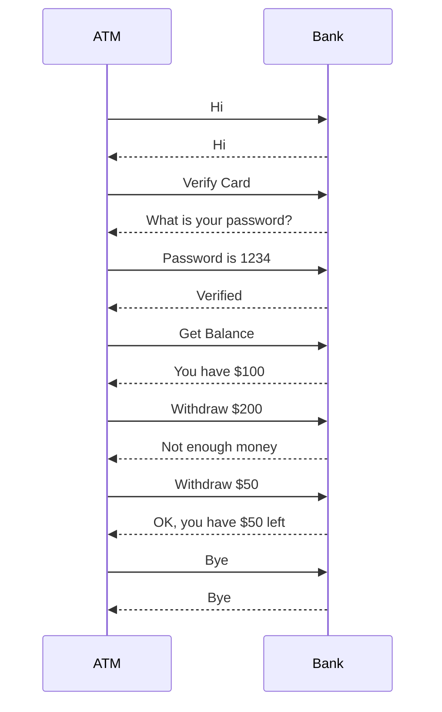

Reference: Computer Networking: A Top-Down Approach, 8th Edition

# 此頁面中答案不保證為正確答案，僅供參考。

# CH1 作業

## Review

### R1. What is the difference between a host and an end system? List several different types of end systems. Is a Web server an end system?

#### Host 跟 End system 差別是什麼？列出幾種不同類型的 End system。Web Server 是 End system 嗎？

- 沒有差別，Host 跟 End system 是同義詞。End system 包括 PC、Work Station、Web Server、Mail Server 等等。

### R2. Describe the protocol that might be used by two people having a telephonic conversation to initiate and end the conversation, i.e., the way that they talk.

#### 描述兩個人進行電話對話時可能使用的協定，即他們交談的方式。

- 協議是兩個人、政府、甚至國家在進行溝通時制定的一套溝通方式。以人為例，A 欲與 B 對話，他需要先向 B 說「你好」，而 B 也需要回應他「你好」，接著 A 把
  他想傳達的內容給 B，B 再回應他「收到」，最後 A 向 B 說「再見」表示結束這次溝通。而如果 A 不照協議規定進行，一開始直接把訊息丟給 B，B 可能會選擇不理 A 而無法順利溝通。

### R3. Why are standards important for protocols?

#### 為什麼標準對於協議來說很重要？

- 標準定義了協議具體要做什麼、內容，以便創建可溝通的網路系統。

### R4. List four access technologies. Classify each one as home access, enterprise access, or wide-area wireless access.

#### 列出四種存取技術。將每一種分類為家庭存取、企業存取或廣域無線存取。

- - 家庭存取：DSL、光纖
  - 企業存取：Ethernet
  - 廣域無線存取：3G/4G

### R5. Is HFC transmission rate dedicated or shared among users? Are collisions possible in a downstream HFC channel? Why or why not?

#### HFC 傳輸速率是專用還是共享給使用者？在下行 HFC 頻道中可能發生碰撞嗎？為什麼？

- HFC 傳輸速率是共享給使用者的。下行 HFC 不會碰撞，因為 HFC 是由單源點發出，不會有碰撞的問題。

### R6. What access network technologies would be most suitable for providing internet access in rural areas?

#### 什麼存取網路技術最適合在鄉村地區提供互聯網存取？

- DSL、光纖到戶

### R7. Dial-up modems and DSL both use the telephone line (a twisted-pair copper cabble) as their transmission medium. Why then is DSL much faster than dial-up access?

#### 撥號數據機和 DSL 都使用電話線（雙絞線銅電纜）作為傳輸媒介。為什麼 DSL 比撥號訪問還快？

- 撥接連線跟處理電話通過一樣的基礎設施。電話的頻寬很低(56 Kbps)，而 DSL 使用從家中到 DSLAM 的電話線路，不經過電信公司處理電話的基礎設施，而且 DSL 使用高頻段，所以速度比較快（24 Mbps）。

### R8. What are some of the physical media that Ethernet can run over?

#### 以太網可以運行在哪些物理媒介上？

- 同軸電纜、光纖、雙絞線

### R9. HFC, DSL, and FTTH are all used for residential access. For each of these access technologies, provide a range of transmission rates and comment on whether the transmission rate is dedicated or shared.

#### HFC、DSL 和 FTTH 都用於住宅接入。對於這些接入技術，提供一個傳輸速率範圍，並討論傳輸速率是專用還是共享。

- - HFC：下行 42.8 Mbps，上行 30.7 Mbps，共享
  - DSL：下行 24 Mbps，上行 3 Mbps，專用
  - FTTH：下行 100 Mbps，上行 100 Mbps，專用

### R10. Describe the different wireless technologies you use during the day and their characteristics. If you have a choice between multiple technologies, why do you prefer one over another?

#### 描述您在一天中使用的不同無線技術及其特性。如果您可以選擇多種技術，為什麼您更喜歡一種而不是另一種？

- WiFi、4G、乙太網路，WiFi 速度快，但距離短。4G 速度慢但距離遠。乙太網路速度快，但需要有線連接。

### R11. Suppose there is exactly one packet switch between a sending host and a receiving host. The transmission rates between the sending host and the switch and between the switch and the receiving host are $R_1$ and $R_2$, respectively. Assuming that the switch uses store-and-forward packet switching, what is the total end-to-end delay to send a packet of length $L$? (Ignore queuing, propagation delay, and processing delay.)

#### 假設在發送主機和接收主機之間有一個封包交換機。發送主機和交換機之間的傳輸速率為 $R_1$，交換機和接收主機之間的傳輸速率為 $R_2$。假設交換機使用存儲轉發封包交換，發送長度為 $L$ 的封包的總端到端延遲是多少？（忽略排隊、傳播延遲和處理延遲。）

- 一開始發送主機開始傳輸。在 $\frac{L}{R_1}$ 後，發送主機完成傳輸，且 router 接收到整個封包(無傳播延遲)。因為 router 已經有完整的封包了，他可以開始傳輸到接收主機，在 $\frac{L}{R_2}$ 後，接收主機接收到封包。所以總延遲為 $\frac{L}{R_1} + \frac{L}{R_2}$。

### R12. What advantage does a circuit-switched network have over a packet-switched network? What advantages does TDM have over FDM in a circuit-switched network?

#### 電路交換網絡相對於封包交換網絡有什麼優勢？在電路交換網絡中，TDM 相對於 FDM 有什麼優勢？

- 電路交換網路保證端對端的頻寬，而封包交換網路不保證。
- 如果發生擁塞，TDM 可能只會 loss 一些資料，而 FDM 可能會 loss 全部。
- FDM 建立連線後，占用的頻寬不能被其他連線使用，可能存在浪費的情況。

### R13. Suppose users share a $2$ Mbps link. Also suppose each user transmits continuously at $1$ Mbps when transmitting, but each user transmits only 20 percent of the time. (See the discussion of statistical multiplexing in Section 1.3.)

#### 假設用戶共用一個 $2$ Mbps 的連線。同時假設每個用戶在傳輸時連續傳輸 $1$ Mbps，但每個用戶只在 $20$% 的時間內傳輸。 (參見第 1.3 節中對統計多路復用的討論。)

- a. When circuit switching is used, how many users can be supported?
    - 當使用電路交換時，可以支持多少用戶？
        - 2 個用戶，每個用戶各使用一半的頻寬。

- b. For the remainder of this problem, suppose packet switching is used. Why will there be essentially no queuing delay before the link if two or fewer users transmit at the same time? Why will there be a queuing delay if three users transmit at the same time?
    - 在這個問題的其餘部分，假設使用封包交換。如果兩個或更少的用戶同時傳輸，為什麼在連接之前基本上不會有排隊延遲？如果三個用戶同時傳輸，為什麼會有排隊延遲？
        - 如果兩個或更少的用戶同時傳輸，那麼他們的傳輸速率不會超過 $2$ Mbps，所以不會有排隊延遲。如果三個用戶同時傳輸，那麼他們的傳輸速率會超過 $2$ Mbps，所以會有排隊延遲。

- c. Find the probability that a given user is transmitting.
    - 找到特定用戶正在傳輸的概率。
        - 0.2

- d. Suppose now there are three users. Find the probability that at any given time, all three users are transmitting simultaneously. Find the fraction of time during which the queue grows.
    - 現在假設有三個用戶。找到在任何給定時間，所有三個用戶同時傳輸的概率。找到隊列增長的時間比。
        - $\binom{3}{3} p^3 (1-p)^{3-3} = (0.2)^3$

### R14. Why will two ISPs at the same level of the hierarchy often peer with each other? How does an IXP earn money?

#### 為什麼位於層次結構相同級別的兩個 ISP 經常互相對等？IXP 如何賺錢？

- 如果兩個 ISP 不互相對等，當他們向彼此發送流量時，必須經過中間的 ISP 而增加成本。互相對等可以減少成本。IXP 可以向 ISP 收取更低價的費用來賺錢，費用可能取決於流量大小。

### R15. Why is a content provider considered a different Internet entity today? How does a content provider connect to other ISPs? Why?

#### 為什麼內容提供商今天被認為是一個不同的互聯網實體？內容提供商如何連接到其他 ISP？為什麼？

- 內容提供商提供內容，而不是提供連線。除非內容提供商有自己的網路，否則他們需要連接到其他 ISP 來提供服務。內容提供商可能會連接到更低層的 ISP 來提供服務，因為這樣可以減少成本。

### R16. Consider sending a packet from a source host to a destination host over a fixed route. List the delay components in the end-to-end delay. Which of these delays are constant and which are variable?

#### 考慮在固定路由上從來源主機發送封包到目的主機。列出端到端延遲中的延遲因子。這些延遲中哪些是恆定的，哪些是變化的？

- - Processing delay：變化(有爭議，原版解答為恆定)
  - Queuing delay：變化
  - Transmission delay：恆定
  - Propagation delay：恆定

### R17. Visit the Transmission Versus Propagation Delay applet at the companion Website. Among the rates, propagation delay, and packet sizes available, find a combination for which the sender finishes transmitting before the first bit of the packet reaches the receiver. Find another combination for which the first bit of the packet reaches the receiver before the sender finishes transmitting.

#### 訪問伴隨網站的傳輸與傳播延遲 applet。在可用的速率、傳播延遲和封包大小中，找到一個組合，使發送方在第一個位元到達接收方之前完成傳輸。找到另一個組合，使封包的第一個位元在發送方完成傳輸之前到達接收方。

- 這裡僅列出關係式，令傳輸速率為 $R$，傳播延遲為 $d_{prop}$，封包大小為 $L$。
    - 在第一個位元到達接收方之前完成傳輸：$\frac{L}{R} < d_{prop}$
    - 在發送方完成傳輸之前到達接收方：$\frac{L}{R} > d_{prop}$

### R18. A user can directly connect to a server through either long-range wireless or a twisted-pair cable for transmitting a 1500-bytes file. The transmission rates of the wireless and wired media are 2 and 100 Mbps, respectively. Assume that the propagation speed in air is $3 \times 10^8$ m/s, while the speed in the twisted pair is $2 \times 10^8$ m/s. If the user is located 1 km away from the server, what is the nodal delay when using each of the two technologies?

#### 用戶可以通過長距離無線或雙絞線纜線直接連接到伺服器，用於傳輸一個 1500 字節的文件。無線和有線媒介的傳輸速率分別為 2 和 100 Mbps。假設空氣中的傳播速度為 $3 \times 10^8$ m/s，而雙絞線中的速度為 $2 \times 10^8$ m/s。如果用戶距離伺服器 1 公里，使用這兩種技術時的節點延遲是多少？

- 無線：$\frac{1500 \times 8\ Kb}{2000\ Kbps} + \frac{1000\ m}{3 \times 10^8\ m/s} = 6s$
- 有線：$\frac{1500 \times 8\ Kb}{100000\ Kbps} + \frac{1000\ m}{2 \times 10^8\ m/s} = 0.12s$

### R19. Suppose Host A wants to send a large file to Host B. The path from Host A to Host B has three links, of rates $R_1$ = 500 kbps, $R_2$ = 2 Mbps, and $R_3$ = 1 Mbps. 

#### 假設主機 A 想要將一個大文件發送給主機 B。從主機 A 到主機 B 的路徑有三個連接，速率分別為 $R_1$ = 500 kbps、$R_2$ = 2 Mbps 和 $R_3$ = 1 Mbps。

- a. Assuming no other traffic in the network, what is the throughput for the file transfer? 
    - 假設網絡中沒有其他流量，文件傳輸的吞吐量是多少？
        - 因為 $R_1$ 最慢，他是 bottleneck，所以吞吐量為 500 kbps。

- b. Suppose the file is 4 million bytes. Dividing the file size by the throughput, roughly how long will it take to transfer the file to Host B? 
    - 假設文件大小為 4 百萬字節。將文件大小除以吞吐量，大約需要多長時間將文件傳輸到主機 B？
        - $\frac{4 \times 10^6\ \times 8\ bits}{500 \times 10^3\ Kbps} = 64s$

- c. Repeat (a) and (b), but now with $R_2$ reduced to 100 kbps.
    - 重複 (a) 和 (b)，但現在將 $R_2$ 降低到 100 kbps。
        - a. 因為 $R_2$ 是最慢的，吞吐量為 100 kbps。
        - b. $\frac{4 \times 10^6\ \times 8\ bits}{100 \times 10^3\ Kbps} = 320s$

### R20. Suppose end system A wants to send a large file to end system B. At a very high level, describe how end system A creates packets from the file. When one of these packets arrives to a router, what information in the packet does the router use to determine the link onto which the packet is forwarded? Why is packet switching in the Internet analogous to driving from one city to another and asking directions along the way?

#### 假設終端系統 A 想要將一個大文件發送給終端系統 B。在非常高的層次上，描述終端系統 A 如何從文件中創建封包。當這些封包中的一個到達路由器時，路由器使用封包中的哪些訊息來確定將封包轉發到哪個連接？為什麼互聯網中的封包交換類似於從一個城市開車到另一個城市並在途中詢問方向？

- 終端系統 A 會將大檔案分成很多個 chunks，並向每個 chunks 加上 header，就可以生成封包。這些 header 包括目的地(終端系統 B)的 IP 位址。封包交換器使用這個目標 IP 位址確定將封包轉發到哪個連接。封包交換類似於開車詢問方向，因為封包交換器在轉發封包時，會根據封包中的目標 IP 位址來決定轉發的連接。

### R21. Visit the Queuing and Loss applet at the companion Web site. What is the maximum emission rate and the minimum transmission rate? With those rates, what is the traffic intensity? Run the applet with these rates and determine how long it takes for packet loss to occur. Then repeat the experiment a second time and determine again how long it takes for packet loss to occur. Are the values different? Why or Why not?

#### 訪問伴隨網站的 Queuing and Loss applet。最大發射速率和最小傳輸速率是多少？使用這些速率，流量強度是多少？使用這些速率運行 applet，並確定發生封包丟失需要多長時間。然後再次重複實驗，並再次確定發生封包丟失需要多長時間。這些值是否不同？為什麼？

- 最大發射速率：$R_1$，最小傳輸速率：$R_2$，流量強度：$R = \frac{R_1}{R_2}$。因為 $R_1$ 是最大發射速率，所以當 $R > 1$ 時，封包會丟失。

### R22. If two end-systems are connected through multiple routers and the data-link level between them ensures reliable data delivery, is a transport protocol offering reliable data delivery between these two end-systems necessary? Why?

#### 如果兩個終端系統通過多個路由器連接，並且它們之間的數據鏈路級確保可靠的數據傳遞，那麼在這兩個終端系統之間提供可靠的數據傳遞的傳輸協議是必要的嗎？為什麼？

- 可靠的資料鏈路協定可以從影響各個鏈路的錯誤中恢復，但中間可能會經過很多路由器，這些路由器都有可能發生錯誤，比如緩衝區滿了所以封包被丟棄。而且路由器可能故障，所以使用可靠的傳輸協議會更有意義。

### R23. What are the five layers in the Internet protocol stack? What are the principal responsibilities of each of these layers?

#### 互聯網協議堆疊中的五層是什麼？這些層的主要責任是什麼？

- - Application：會實作在終端系統的應用程式中，負責解封裝較低層的資料，使得封包可以被應用程式使用，如 HTTP、FTP、SMTP。
  - Transport：封裝 Application 層的封包，並制定一套傳輸協議給 Network 層，如 TCP、UDP。
  - Network：封裝 Application, Transport 層的封包，加上目的地的 IP 位址，決定封包的路徑，如 IP。
  - Link：封裝 Application, Transport, Network 層的封包，加上 MAC 位址，負責將封包傳送到下一個節點，如 ARP。
  - Physical：將封包轉換成訊號傳遞，如 RJ45。

### R24. What do encapsulation and de-encapsulation mean? Why are they needed in a layered protocol stack?

#### 封裝和解封裝是什麼意思？為什麼在分層協議堆疊中需要它們？

- 封裝是將較低層的資料加上 header，使得資料可以被傳送到下一層。解封裝是將 header 從資料中移除，使得資料可以被應用程式使用。分層協議堆疊需要封裝和解封裝，因為每一層的資料都需要加上 header，使得資料可以被下一層使用。

### R25. Which layers in the Internet protocol stack does a router process? Which layers does a link-layer switch process? Which layers does a host process? 

#### 互聯網協議堆疊中的哪些層由路由器處理？交換機處理哪些層？主機處理哪些層？

- - Router：Network、Link、Physical
  - Link-layer switch：Link、Physical
  - Host：Application、Transport、Network、Link、Physical

### R26. What is self-replicating malware?

#### 什麼是自我複製的惡意軟體？

-  可以複製自己的惡意軟體，並透過網路或其他方式，利用漏洞感染其他電腦。

### R27. Describe how a botnet can be created and how it can be used for a DDoS attack

#### 描述如何創建 botnet 以及如何將其用於 DDoS 攻擊

- Botnet 是由攻擊者找到漏洞感染了大量電腦並組成的網路，攻擊者可以透過 C2 伺服器向 botnet 中所有節點發出指令，並針對某個目標發動大量封包使其癱瘓。如：TCP SYN 攻擊。

### R28. Suppose Alice and Bob are sending packets to each other over a computer network. Suppose Trudy positions herself in the network so that she can capture all the packets sent by Alice and send whatever she wants to Alice. List some of the malicious things Trudy can do from this position.

#### 假設 Alice 和 Bob 通過計算機網路互相發送封包。假設 Trudy 將自己放在網路中，以便她可以捕獲 Alice 發送的所有封包並向 Alice 發送她想要的任何東西。列出 Trudy 可以從這個位置做的一些惡意事情。

- Trudy 可以假扮成 Bob，並向 Alice 發送假封包。或者丟棄 Bob 給 Alice 的封包，即使已加密。

## Problems

### P1. Design and describe an application-level protocol to be used between a automatic teller machine and a bank's centralized computer. Your protocol should allow a user's card and password to be verified, the account balance (which is maintained at the centralized computer) to be queried, and an account withdrawal to be made (that is, money disbursed to the user). Your protocol entities should be able to handle the all-too-common case in which there is not enough money in the account to cover the withdrawal. Specify your protocol by listing the messages exchanged and the action taken by the automatic teller machine or the bank's centralized computer on transmission and receipt of messages. Sketch the operation of your protocol for the case of a simple withdrawal with no errors, using a diagram similar to that in Figure 1.2. Explicitly state the assumptions made by your protocol about the underlying end-to-end transport service.

#### 設計並描述一個應用層協議，用於自動取款機和銀行的集中式計算機之間。您的協議應該允許驗證用戶的卡和密碼，查詢帳戶餘額（在集中式計算機上維護），並進行帳戶提款（即向用戶發放資金）。您的協議實體應該能夠處理常見情況，即帳戶中沒有足夠的資金來支付提款。通過列出交換的消息和自動取款機或銀行的集中式計算機在傳送和接收消息時採取的操作來指定您的協議。使用與圖 1.2 類似的圖表，為沒有錯誤的簡單提款情況下的協議操作繪製示意圖。明確說明您的協議對於底層端到端傳輸服務的假設。

### P2. Equation 1.1 gives a formula for the end-to-end delay of sending one packet of length L over N links of transmission rate R. Generalize this formula for sending P such packets back-to-back over the N links.

#### 方程式 1.1 給出了在 N 個傳輸速率為 R 的連接上發送長度為 L 的一個封包的端到端延遲的公式。將此公式概括為在 N 個連接上連續發送 P 個這樣的封包。

方程式 1.1：$d_{end-to-end} = N \times \frac{L}{R}$

- 在時間 $N \times \frac{L}{R}$，第一個封包已到達目的地，第二個封包存在最後一個路由器，第三個在倒數第二個路由器，以此類推。所以所有封包到達目的地的總時間為 $N \times \frac{L}{R} + (P-1) \times \frac{L}{R} = (N+P-1) \times \frac{L}{R}$。

### P3. Consider an application that transmits data at a steady rate (for example, the sender generates an N-bit unit of data every k time units, where k is small and fixed). Also, when such an application starts, it will continue running for a relatively long period of time. Answer the following questions, briefly justifying your answer:

#### 考慮一個以恆定速率傳輸數據的應用（例如，發送方每 k 個時間單位生成一個 N 位數據單元，其中 k 很小且固定）。此外，當這樣的應用程序啟動時，它將持續運行相對較長的時間。回答以下問題，簡要說明您的答案：

- a. Would a packet-switched network or a circuit-switched network be more appropriate for this application? Why?
    - 封包交換網路或電路交換網路對於這個應用更合適？為什麼？
        - 電路交換網路更適合，因為應用會持續進行，可以預測需要的頻寬。由於傳輸速率已知而不是突發，所以可為每個應用 session 保留頻寬而不造成浪費。此外，建立和斷開連線的開銷成本在這種情況下會被分攤抵銷。
    
- b. Suppose that a packet-switched network is used and the only traffic in this network comes from such applications as described above. Furthermore, assume that the sum of the application data rates is less than the capacities of each and every link. Is some form of congestion control needed? Why?
    - 假設使用封包交換網路，並且此網路中的唯一流量來自上述描述的應用程序。此外，假設應用數據速率的總和小於每個連接的容量。是否需要某種形式的擁塞控制？為什麼？
        - 在最壞情況下，所有應用程式同時透過一個或多個 link 傳輸，但因為每個 link 頻寬都足夠，不會發生擁塞。所以不需要擁塞控制。

### P4. Consider the circuit-switched network in Figure 1.13. Recall that there are 4 circuits on each link. Label the four switches A, B, C, and D, going in the clockwise direction. a.  What is the maximum number of simultaneous connections that can be in progress at any one time in this network?

#### 考慮圖 1.13 中的電路交換網路。回想一下，每條連接上有 4 個電路。標記四個開關 A、B、C 和 D，按順時針方向標記。a. 這個網路中同時進行的最大連接數是多少？

- a.  What is the maximum number of simultaneous connections that can be in progress at any one time in this network? 
    - 這個網路中同時進行的最大連接數是多少？
        - 因為每條鏈路上都有 4 個電路，可以同時進行 $4 \times 4 = 16$ 個連接。

- b.  Suppose that all connections are between switches A and C. What is the maximum number of simultaneous connections that can be in progress? 
    - 假設所有連接都是在開關 A 和 C 之間。同時進行的最大連接數是多少？
        - 可以用 4 個鏈路通過 B，4 個鏈路通過 D，所以最多可以同時進行 8 個連接。

- c.  Suppose we want to make four connections between switches A and C, and another four connections between switches B and D. Can we route these calls through the four links to accommodate all eight connections?
    - 假設我們想要在開關 A 和 C 之間建立四個連線，並在開關 B 和 D 之間建立另外四個連線。我們可以通過四個鏈路路由這些呼叫以容納所有八個連線嗎？
        - 可以，對於 A 和 C 之間的連線，透過 B 路由，對於 B 和 D 之間的連線，透過 D 路由，這樣最多有 4 個連線通過每個鏈路。

### P5. Review the car-caravan analogy in Section 1.4. Assume a propagation speed of 100 km/hour.

#### 回顧第 1.4 節中的汽車-旅行隊類比。假設傳播速度為 100 km/小時。

- a. Suppose the caravan travels 175 km, beginning in front of a tollbooth, passing through a second tollbooth, and finishing just after a third tollbooth. What is the end-to-end delay?
    - 假設旅行隊行駛 175 公里，從收費站前開始，通過第二個收費站，並在第三個收費站後結束。端到端延遲是多少？
        - 車速 100 km/h，一個收費站服務一台車要花 12 秒
        - 有 10 台車，所以服務時間花了 120 秒，三個收費站 360 秒，傳播延遲為 $\frac{175}{100} = 1.75h$，所以總延遲為 1 小時 51 分鐘。

- b. Repeat (a), now assuming that there are eight cars in the caravan instead of ten.
    - 重複 (a)，現在假設旅行隊中有八輛車，而不是十輛。
        - 服務時間花了 96 秒，三個收費站 288 秒，傳播延遲為 1.75 小時，所以總延遲為 1 小時 4 分鐘 48 秒。

### P6. This elementary problem begins to explore propagation delay and transmission delay, two central concepts in data networking. Consider two hosts, A and B, connected by a single link of rate R bps. Suppose that the two hosts are separated by m meters, and suppose the propagation speed along the link is s meters/sec. Host A is to send a packet of size L bits to Host B.

#### 這個基本問題開始探討數據網絡中的傳播延遲和傳輸延遲，這是兩個核心概念。考慮兩個主機 A 和 B，它們之間通過速率為 R bps 的單個鏈路連接。假設兩個主機之間相距 m 公尺，並假設沿連接的傳播速度為 s 公尺/秒。主機 A 要將大小為 L 位的封包發送到主機 B。

- a. Express the propagation delay, $d_{prop}$, in terms of $m$ and $s$.
    - 用 m 和 s 表示傳播延遲 dprop。
        - $d_{prop} = \frac{m}{s} sec$

- b. Determine the transmission time of the packet, $d_{trans}$, in terms of $L$ and $R$.
    - 用 $L$ 和 $R$ 表示封包的傳輸時間 $d_{trans}$。
        - $d_{trans} = \frac{L}{R} sec$

- c. Ignoring processing and queuing delays, obtain an expression for the end-to-end delay.
    - 忽略處理和排隊延遲，獲得端到端延遲的表達式。
        - $d_{end-to-end} = d_{prop} + d_{trans} = \frac{m}{s} + \frac{L}{R} sec$

- d. Suppose Host A begins to transmit the packet at time $t = 0$. At time $t = d_{trans}$, where is the last bit of the packet?
    - 假設主機 A 在時間 $t = 0$ 開始傳輸封包。在時間 $t = d_{trans}$，封包的最後一位在哪裡？
        - 剛離開 A

- e. Suppose $d_{prop}$ is greater than $d_{trans}$. At time $t = d_{trans}$, where is the first bit of the packet?
    - 假設 $d_{prop}$ 比 $d_{trans}$ 大。在時間 $t = d_{trans}$，封包的第一位在哪裡？
        - 在鏈路中，還沒到 B

- f. Suppose $d_{prop}$ is less than $d_{trans}$. At time $t = d_{trans}$, where is the first bit of the packet?
    - 假設 $d_{prop}$ 比 $d_{trans}$ 小。在時間 $t = d_{trans}$，封包的第一位在哪裡？
        - 在 B

- g. Suppose $s = 2.5 \times 10^8$, $L = 1500 bytes$, and $R = 10 Mbps$. Find the distance $m$ so that $d_{prop}$ equals $d_{trans}$.
    - 假設 $s = 2.5 \times 10^8$，$L = 1500 bytes$，$R = 10 Mbps$。找到距離 $m$，使 $d_{prop}$ 等於 $d_{trans}$。
        - $\frac{m}{2.5 \times 10^8} = \frac{1500 \times 8}{10 \times 10^6}$，$m$ = 300000 公尺

### P7. In this problem, we consider sending real-time voice from Host A to Host B over a packet-switched network (VoIP). Host A converts analog voice to a digital 64 kbps bit stream on the fly. Host A then groups the bits into 56-byte packets. There is one link between Hosts A and B; its transmission rate is 10 Mbps and its propagation delay is 10 msec. As soon as Host A gathers a packet, it sends it to Host B. As soon as Host B receives an entire packet, it converts the packet's bits to an analog signal. How much time elapses from the time a bit is created (from the original analog signal at Host A) until the bit is decoded (as part of the analog signal at Host B)?

#### 在這個問題中，我們考慮在封包交換網路上從主機 A 發送實時語音到主機 B（VoIP）。主機 A 將模擬語音轉換為 64 kbps 的數位位流。主機 A 然後將位組分組為 56 字節的封包。主機 A 和 B 之間有一個連接；其傳輸速率為 10 Mbps，傳播延遲為 10 毫秒。一旦主機 A 收集到一個封包，它就將其發送到主機 B。一旦主機 B 收到整個封包，它就將封包的位元轉換為模擬信號。從創建位元（從主機 A 的原始模擬信號）到解碼位元（作為主機 B 的模擬信號的一部分）經過多少時間？

- 一個封包生成的時間是 $\frac{56 \times 8}{64 \times 10^3} = 0.007s$，傳送封包的時間是 $\frac{56 \times 8}{10 \times 10^6} = 0.0000448s$，加上傳播延遲 0.01s，所以總時間是 0.0170448s。

### P8.  Suppose users share a 10 Mbps link. Also suppose each user requires 200 kbps when transmitting, but each user transmits only 10 percent of the time. (See the discussion of packet switching versus circuit switching in Section 1.3.)

#### 假設用戶共享一條 10 Mbps 的鏈路。同時假設每個用戶在傳輸時需要 200 kbps，但每個用戶只在 10% 的時間內傳輸。 （參見第 1.3 節中關於封包交換與電路交換的討論。）

- a. When circuit switching is used, how many users can be supported?
    - 使用電路交換時，可以支持多少用戶？
        - 10 Mbps / 200 kbps = 50 users

- b. For the remainder of this problem, suppose packet switching is used. Find the probability that a given user is transmitting.
    - 在本問題的其餘部分，假設使用封包交換。找到特定用戶正在傳輸的機率。
        - 10% 的時間傳輸，所以機率是 0.1

- c. Suppose there are 120 users. Find the probability that at any given time, exactly n users are transmitting simultaneously.
    - 假設有 120 個用戶。找到在任何給定時間，恰好有 n 個用戶同時傳輸的機率。
        - $\binom{120}{n} \times 0.1^{n} \times 0.9^{120-n}$

- d. Find the probability that there are 21 or more users transmitting simultaneously.
    - 找到同時有 51 個或更多用戶傳輸的機率。
        - $P(x \geq 51) = 1 - P(x \leq 50) = 1 - \sum_{i=0}^{50} \binom{120}{i} \times 0.1^{i} \times 0.9^{120-i}$
        - 趨近於 0

### P9. Consider the discussion in Section 1.3 of packet switching versus circuit switching in which an example is provided with a 1 Mbps link. Users are generating data at a rate of 100 kbps when busy, but are busy generating data only with probability p = 0.1. Suppose that the 1 Mbps link is replaced by a 1 Gbps link.

#### 考慮第 1.3 節中有關封包交換與電路交換的討論，其中提供了一個 1 Mbps 鏈路的示例。當忙碌時，用戶以 100 kbps 的速率生成數據，但只有機率 p = 0.1 時才忙於生成數據。假設 1 Mbps 鏈路被 1 Gbps 鏈路取代。

- a. What is N, the maximum number of users that can be supported with a 1 Gbps link?
    - N 是可以使用 1 Gbps 鏈路支持的最大用戶數是多少？
        - 1 Gbps / 100 kbps = 10000 users

- b. Now consider packet switching and a user population of M users. Give a formula (in terms of p, M, N) for the probability that more than N users are sending data.
    - 現在考慮封包交換和 M 用戶的用戶群。給出一個公式（以 p、M、N 表示），表示發送數據的用戶數超過 N 的機率。
        - $\sum_{i=N+1}^{M} \binom{M}{i} \times p^{i} \times (1-p)^{M-i}$

### P10. Consider the network illustrated in Figure 1.16. Assume the two hosts on the left of the figure start transmitting packets of 1500 bytes at the same time towards Router B. Suppose the link rates between the hosts and Router A is 4-Mbps. One link has a 6-ms propagation delay and the other has a 2-ms propagation delay. Will queuing delay occur at Router A?

#### 考慮圖 1.16 中顯示的網路。假設圖中左側的兩個主機在同一時間開始向路由器 B 傳送 1500 字節的封包。假設主機和路由器 A 之間的鏈路速率為 4 Mbps。一條鏈路的傳播延遲為 6 毫秒，另一條鏈路的傳播延遲為 2 毫秒。在路由器 A 會發生排隊延遲嗎？

- 傳播延遲較低的主機發送的第一位在 2ms 時到達 Router A，最後一位在 $2ms + \frac{1500 \times 8}{4 \times 10^6}s = 5ms$ 時到達 Router A，而傳播延遲較高的主機發送的第一位在 6ms 時到達 Router A，此時另一台主機的封包已經完全到達 Router A，所以不會發生排隊延遲。

### P11. Consider the scenario in Problem P10 again, but now assume the links between the hosts and Router A have different rates R1 and R2 byte/s in addition to different propagation delays di and d2. Assume the packet lengths for the two hosts are of L bytes. For what values of the propagation delay will no queuing delay occur at Router A?

#### 再次考慮問題 P10 中的情況，但現在假設主機和路由器 A 之間的鏈路速率 $R_1$ 和 $R_2$ 字節/秒不同，並且具有不同的傳播延遲 $d_1$ 和 $d_2$。假設兩個主機的封包長度為 L 字節。對於哪些傳播延遲值，路由器 A 不會發生排隊延遲？

- 假設 $d_1 < d_2$，為了不發生排隊延遲，要求 $d_2 > d_1 + \frac{L}{R_1}$，此例假設路由器的 transmission rate 無限，也就是 $d_{trans} = 0$。

### P12. Consider a client and a server connected through one router. Assume the router can start transmitting an incoming packet after receiving its first h bytes instead of the whole packet. Suppose that the link rates are R byte/s and that the client transmits one packet with a size of L bytes to the server. What is the end-to-end delay? Assume the propagation, processing, and queuing delays are negligible. Generalize the previous result to a scenario where the client and the server are interconnected by N routers.

#### 考慮一個通過一個路由器連接的客戶端和伺服器。假設路由器在接收到第一個 h 字節後就可以開始傳輸傳入的封包，而不是整個封包。假設鏈路速率為 R 字節/秒，並且客戶端向伺服器傳輸一個大小為 L 字節的封包。端到端延遲是多少？假設傳播、處理和排隊延遲可以忽略。將先前的結果概括到客戶端和伺服器通過 N 個路由器相互連接的情況。

- 路由器需要 $\frac{h}{R}$ 的時間開始傳輸，整個封包需要 $\frac{L}{R}$ 到達伺服器，端對端總延遲是 $\frac{h + L}{R}$。在 N 個路由器的情況下，最後一個路由器需要 $\frac{N \times h}{R}$ 的時間開始傳輸，整個封包需要 $\frac{L}{R}$ 到達伺服器，端對端總延遲是 $\frac{N \times h + L}{R}$。

### P13. 

- (a) Suppose N packets arrive simultaneously to a link at which no packets are currently being transmitted or queued. Each packet is of length L and the link has transmission rate R. What is the average queuing delay for the N packets? 
    - 假設 N 個封包同時到達一個鏈路，該鏈路目前沒有正在傳輸或排隊的封包。每個封包的長度為 L，鏈路的傳輸速率為 R。N 個封包的平均排隊延遲是多少？
        - 第一個封包排隊延遲為 0，第二個封包排隊延遲為 $\frac{L}{R}$，第三個封包排隊延遲為 $\frac{2L}{R}$，以此類推，所以 N 個封包的平均排隊延遲為 $\frac{(N-1)L}{2R}$。

- (b) Now suppose that N such packets arrive to the link every LN/R seconds. What is the average queuing delay of a packet?
    - 現在假設每 LN/R 秒有 N 個這樣的封包到達鏈路。一個封包的平均排隊延遲是多少？
        - 傳輸 N 個封包需要 LN/R 秒，每 N 個封包到達時緩衝區為空，所以一個封包在整批封包的平均延遲就是一批封包的平均延遲，即 $\frac{(N-1)L}{2R}$。

### P14. Consider the queuing delay in a router buffer. Let I denote traffic intensity; that is, I = La/R. Suppose that the queuing delay takes the form $\frac{IL}{R(1-I)}$ for I < 1.

#### 考慮路由器緩衝區中的排隊延遲。讓 I 表示流量強度；即 I = La/R。假設對於 I < 1，排隊延遲的形式為 $\frac{IL}{R(1-I)}$。

- a. Provide a formula for the total delay, that is, the queuing delay plus the transmission delay.
    - 給出總延遲的公式，即排隊延遲加上傳輸延遲。
        - $d_{trans} = \frac{L}{R}$，$d_{total} = \frac{IL}{R(1-I)} + \frac{L}{R} = \frac{\frac{L}{R}}{1-I}$

- b. Plot the total delay as a function of L/R.
    - 找到總延遲對 L/R 的函數
        - 令 $x = \frac{L}{R}$，$d_{total} = \frac{x}{1-ax}$

### P15. Let a denote the rate of packets arriving at a link in packets/sec, and let μ denote the link's transmission rate in packets/sec. Based on the formula for the total delay (i.e., the queuing delay plus transmission delay) derived in the previous problem, derive a formula for the total delay in terms of a and μ.

#### 讓 a 表示到達鏈路的封包速率（封包/秒），讓 μ 表示鏈路的傳輸速率（封包/秒）。根據上一個問題中導出的總延遲公式（即排隊延遲加傳輸延遲），導出一個關於 a 和 μ 的總延遲公式。

- $d_{total} = \frac{\frac{L}{R}}{1-I} = \frac{\frac{L}{R}}{1-aL/R} = \frac{1}{\mu - a}$

### P16. Consider a router buffer preceding an outbound link. In this problem, you will use Little's formula, a famous formula from queuing theory. Let N denote the average number of packets in the buffer plus the packet being transmitted. Let d denote the rate of packets arriving at the link. Let d denote the average total delay (i.e., the queuing delay plus the transmission delay) experienced by a packet. Little's formula is $N = a \cdot d$. Suppose that on average, the buffer contains 100 packets, and the average packet queuing delay is 20 msec. The link's transmission rate is 100 packets/sec. Using Little's formula, what is the average packet arrival rate, assuming there is no packet loss? 

#### 考慮一個位於出站鏈路之前的路由器緩衝區。在這個問題中，您將使用 Little's formula，這是排隊理論中的一個著名公式。讓 N 表示緩衝區中的平均封包數加上正在傳輸的封包。讓 d 表示到達鏈路的封包速率。讓 d 表示封包經歷的平均總延遲（即排隊延遲加傳輸延遲）。Little's formula 是 $N = a \cdot d$。假設平均而言，緩衝區包含 100 個封包，平均封包排隊延遲為 20 毫秒。鏈路的傳輸速率為 100 封包/秒。使用 Little's formula，假設沒有封包丟失，平均封包到達速率是多少？

- N 為緩衝區平均封包數加上正在傳輸的封包，所以 N = 101，根據公式，$101 = a(d_{queue} + d{trans}) = a \times (0.02 + \frac{1}{100})$，所以 a = 3366.67 封包/秒。

### P17. Consider the network illustrated in Figure 1.12. Would Equation 1.2 hold in such a scenario? If so, under which conditions? If not, why? (Assume N is the number of links between a source and a destination in the figure.) 

#### 考慮圖 1.12 中顯示的網路。在這種情況下，方程式 1.2 是否成立？如果是，則在哪些條件下？如果不是，為什麼？（假設 N 是圖中源和目的地之間的連接數。）

- 如果沒有擁塞且只考慮圖中的唯一流量，則公式依然成立。如果訊息同時通過至少一個公共路由器，公共鏈路的吞吐量降低，可能導致公式不成立，因為還要考慮排隊延遲。

### P18. Perform a Traceroute between source and destination on the same continent at three different hours of the day.

#### 在同一地點上的來源和目的地之間的三個不同時間執行 Traceroute。

- 略

### P19. Metcalfe's law states the value of a computer network is proportional to the square of the number of connected users of the system. Ley n denote the number of users in a computer network. Assuming each user sends one message to each of the other users, how many messages will be sent? Does your answer support Metcalfe's law?

#### Metcalfe's 定律指出，計算機網絡的價值與系統中連接的用戶數的平方成正比。讓 n 表示計算機網絡中的用戶數。假設每個用戶向其他每個用戶發送一條消息，將發送多少條消息？您的答案是否支持 Metcalfe's 定律？

- 每個用戶向其他用戶發送 n-1 條消息，所以總共發送了 $n \times (n-1)$ 條消息，支持 Metcalfe's 定律。

### P20. Consider the throughput example corresponding 10 Figure 1.20(b). Now suppose that there are M client-server pairs rather than 10. Denote $R_s$, $R_c$, and $R$ for the rates of the server links, client links, and network link. Assume all other links have abundant capacity and that there is no other traffic in the network besides the traffic generated by the M client-server pairs. Derive a general expression for throughput in terms of $R_s$, $R_c$, $R$, and M

#### 考慮與圖 1.20(b) 對應的吞吐量示例。現在假設有 M 對客戶端-伺服器，而不是 10 對。對服務器鏈路、客戶端鏈路和網絡鏈路的速率分別表示為 $R_s$、$R_c$ 和 $R$。假設所有其他鏈路都有充足的容量，並且除了 M 對客戶端-伺服器生成的流量之外，網絡中沒有其他流量。根據 $R_s$、$R_c$、$R$ 和 M，推導出吞吐量的一般表達式。

- 吞吐量為 $min(R_s, R_c, R/M)$

### P21. Assume a client and a server can connect through either network (a) or (b) in Figure 1.19(b). Assume that $R_i = (R_c + R_s) / i$, for $i = 1, 2,…, N$. In what case will network (a) have a higher throughput than network (b)?

#### 假設客戶端和伺服器可以通過圖 1.19(b) 中的網路 (a) 或 (b) 連接。假設 $R_i = (R_c + R_s) / i$，對於 $i = 1, 2,…, N$。在什麼情況下，網路 (a) 的吞吐量高於網路 (b)？

- 吞吐量取決於 bottleneck link 的 transmission rate，a 的吞吐量為 $min(R_c, R_s)$，b 為 $(R_c + R_s)/N$(因為題目假設 $R_i = (R_c + R_s) / i$ 所以最小的是 $R_n$)，若 a 的吞吐量為 $R_c$，$R_s > (R_c + R_s)/N$，$R_c > R_s/(N-1)$
- 若 a 的吞吐量為 $R_s$，$R_c > (R_c + R_s)/N$，$R_s > R_c/(N-1)$

### P22. Consider Figure 1.19(b). Suppose that each link between the server and the client has a packet loss probability p, and the packet loss probabilities for these links are independent. What is the probability that a packet (sent by the server) is successfully received by the receiver? If a packet is lost in the path from the server to the client, then the server will re-transmit the packet. On average, how many times will the server re-transmit the packet in order for the client to successfully receive the packet?

#### 考慮圖 1.19(b)。假設伺服器和客戶端之間的每個鏈路都有一個封包丟失概率 p，並且這些鏈路的封包丟失概率是獨立的。一個封包（由伺服器發送）成功被接收者接收的概率是多少？如果在從伺服器到客戶端的路徑中丟失了一個封包，則伺服器將重新傳送封包。伺服器平均需要重新傳送多少次封包，以便客戶端成功接收封包？

- 成功收到封包的機率是 $p_s = (1-p)^N$，平均要傳 $1/p_s$ 次才成功，所以要重傳 $1/p_s - 1$ 次。

### P23. Consider Figure1.19(a). Assume that we know the bottleneck link along the path from the server to the client is the first link with rate Rs bits/sec. Suppose we send a pair of packets back to back from the server to the client, and there is no other traffic on this path. Assume each packet of size L bits, and both links have the same propagation delay dprop.

#### 考慮圖 1.19(a)。假設我們知道從伺服器到客戶端的路徑上的瓶頸鏈路是第一個速率為 Rs 位/秒的鏈路。假設我們從伺服器發送一對封包到客戶端，並且在這條路徑上沒有其他流量。假設每個封包的大小為 L 位，並且兩個鏈路具有相同的傳播延遲 dprop。

- a. What is the packet inter-arrival time at the destination? That is, how much time elapses from when the last bit of the first packet arrives until the last bit of the second packet arrives?
    - 在目的地的封包到達時間是多少？也就是從第一個封包的最後一位到達到第二個封包的最後一位到達經過多少時間？
        - 因為第一個鏈路是 bottleneck link，第二個封包會需要排隊，時間是 $\frac{L}{Rs}$

- b. Now assume that the second link is the bottleneck link (i.e., RC < Rs). Is it possible that the second packet queues at the input queue of the second link? Explain. Now suppose that the server sends the second packet T seconds after sending the first packet. How large must T be to ensure no queuing before the second link? Explain.
    - 現在假設第二個鏈路是瓶頸鏈路（即 RC < Rs）。第二個封包可能在第二個鏈路的輸入隊列中排隊嗎？解釋。現在假設伺服器在發送第一個封包後 T 秒發送第二個封包。為了確保第二個鏈路之前沒有排隊，T 必須有多大？解釋。
        - 第二個封包會在第一個封包完成傳輸前到達第二個鏈路，$L/R_s + L/R_s + d_{prop} < L/R_s + d_{prop} + L/R_c$
        - 若要延遲 T 秒發送使得不排隊，$L/R_s + T + L/R_s + d_{prop} < L/R_s + d_{prop} + L/R_c$，$T < \frac{L}{R_c} - \frac{L}{R_s}$

### P24. Consider a user who needs to transmit 1.5 gigabytes of data to a server. The user lives in a small town where only dial-up access is available. A bus visits the small town once a day from the closest city, located 150 km away, and stops in front of the user’s house. The bus has a 100-Mbps WiFi connection. It can collect data from users in rural areas and transfer them to the Internet through a 1 Gbps link once it gets back to the city. Suppose the average speed of the bus is 60 km/h. What is the fastest way the user can transfer the data to the server?

#### 考慮一個需要向伺服器傳輸 1.5 GB 數據的用戶。用戶住在一個只能使用撥號訪問的小鎮。一輛公車每天從距離 150 公里的最近城市到小鎮，並停在用戶家門前。公車有一個 100 Mbps 的 WiFi 連接。它可以從鄉村地區的用戶收集數據，並通過 1 Gbps 鏈路將它們傳輸到互聯網，一旦回到城市。假設公車的平均速度是 60 km/h。用戶可以將數據傳輸到伺服器的最快方式是什麼？

- 撥號：$\frac{1.5 \times 10^9 \times 8}{56 \times 10^3} = 214285.71s$
- 公車：
    - 傳到公車上要 $\frac{1.5 \times 10^9 \times 8}{100 \times 10^6} = 120s$
    - 公車開到城市：$\frac{150}{60} \times 3600 = 3600s$
    - 傳到伺服器：$\frac{1.5 \times 10^9 \times 8}{1 \times 10^9} = 12s$
    - 總共 3732s
- 公車比較快

### P25. Suppose two hosts, A and B. are separated by 20,000 kilometers and are connected by a direct link of R = 5 Mbps. Suppose the propagation speed over the link is $2.5 \cdots 108$ meters/sec.

#### 假設兩個主機 A 和 B 相距 20,000 公里，並通過速率為 R = 5 Mbps 的直接鏈路連接。假設鏈路上的傳播速度為 $2.5 \times 10^8$ 米/秒。

- a. Calculate the bandwidth-delay product. $R \cdots d_{prop}$. 
    - 計算帶寬-延遲乘積。$R \cdots d_{prop}$。
        - $5 \times 10^6 \times \frac{2 \times 10^7}{2.5 \times 10^8} = 400000 bits$

- b. Consider sending a file of 800,000 bits from Host A to Host 8. Suppose the file is sent continuously as one large message. What is the maximum number of bits that will be in the link at any given time?
    - 考慮從主機 A 發送 800,000 位的文件到主機 8。假設文件作為一個大消息連續發送。在任何給定時間點，鏈路上的最大位數是多少？
        - 400000 bits

- c. Provide an interpretation of the bandwidth-delay product.
    - 提供帶寬-延遲乘積的解釋。
        - 帶寬-延遲乘積是在傳輸過程中在鏈路上的最大位數，也就是說在這個數量的位數傳輸完之前，不會有新的位數進入鏈路。

- d. What is the width (in meters) of a bit in the link? Is it longer than a football field?
    - 一個位在鏈路中的寬度是多少（以米為單位）？比足球場長嗎？
        - $\frac{2 \times 10^7}{400000} = 50m$，沒踢過足球所以我不知道足球場有多長，查到足球場大概 100m，所以比足球場短。

- e. Derive a general expression for the width of a bit in terms of the propagation speed s, the transmission rate R, and the length of the link m.
    - 根據傳播速度 s、傳輸速率 R 和鏈路長度 m，推導位的寬度的一般表達式。
        - 位寬度 = 長度 / 帶寬-延遲乘積
        - $\frac{m}{R(m/s)} = \frac{s}{R}$

### P26. Consider problem P25 but now with a link of R = 1 Gbps.

- a. Calculate the bandwidth-delay product.
    - $1 \times 10^9 \times \frac{2 \times 10^7}{2.5 \times 10^8} = 80000000 bits$

- b. Consider sending a file of 800,000 bits from Host A to Host B. Suppose the file is sent continuously as one large message. What is the maximum number of bits that will be in the link at any given time?
    - min(帶寬延遲積, 封包大小) = 800000 bits

- c. What is the width (in meters) of a bit in the link?
    - $\frac{s}{R} = \frac{2.5 \times 10^8}{1 \times 10^9} = 0.25m$

### P27. Consider the scenario illustrated in Figure 1.19(a). Assume $R_s$ is 20 Mbps, $R_c$ is 10 Mbps, and the server is continuously sending traffic to the client. Also assume the router between the server and the client can buffer at most four messages. After how many messages sent by the server will packet loss starts occurring at the router?

#### 考慮圖 1.19(a) 中顯示的情況。假設 $R_s$ 為 20 Mbps，$R_c$ 為 10 Mbps，並且伺服器不斷向客戶端發送流量。還假設伺服器和客戶端之間的路由器最多可以緩衝四條消息。在伺服器發送多少條消息後，路由器開始發生封包丟失？

- $R_s : R_c = 2 : 1$，當 router 收到兩個 messages 時會有一個在 queue。
- 0 -> 2 -> 4 -> 6 -> 8 -> 10
- 0 -> 1 -> 2 -> 3 -> 4 -> x
- 到第 10 個封包會發生 loss

### P28. Generalize the result obtained in Problem P27 for the case where the router can buffer m messages.

#### 對於路由器可以緩衝 m 條消息的情況，概括問題 P27 中獲得的結果。

- 設 n 為第 n 個收到的 message，則 buffer 裡有 $\[ \frac{n}{2} \]$ 個 message，當 $\[ \frac{n}{2} \] > m$ 時發生 loss。

### P29. Suppose there is a 10-Mbps microwave link between a geostationary satellite and its base station on Earth. Every minute the satellite takes a digital photo and sends it to the base station. Assume a propagation speed of 2.4 •108 meters/sec. a. What is the propagation delay of the link?

#### 假設地球上的靜止衛星和地面基站之間有一條 10 Mbps 的微波鏈路。每分鐘，衛星拍攝一張數字照片並將其發送到基站。假設傳播速度為 2.4 •108 米/秒。a. 鏈路的傳播延遲是多少？

- a. What is the propagation delay of the link?
    - 地球靜止軌道高度約 36000 km，所以傳播延遲為 $\frac{36000 \times 10^3}{2.4 \times 10^8} = 0.15s$

- b. What is the bandwidth-delay product?
    - $10 \times 10^6 \times 0.15 = 1500000 bits$

- c. Let x denote the size of the photo. What is the minimum value of x for the microwave link to be continuously transmitting?
    - 每一分鐘拍一張，最小值為 $60 \times 10^7 = 600000000 bits$

### P30. Consider the airline travel analogy in our discussion of layering in Section 1.5, and the addition of headers to protocol data units as they flow down the protocol stack. Is there an equivalent notion of header information that is added to passengers and baggage as they move down the airline protocol stack?

#### 考慮我們在第 1.5 節中討論的分層中的航空旅行類比，以及隨著協議堆疊向下流動時對協議數據單元添加標頭。是否有等效的標頭信息添加到乘客和行李上，當它們沿著航空公司協議堆疊向下移動時？

- 略

### P31. In modern packet-switched networks, including the Internet, the source host segments long, application-layer messages (for example. an image or a music file) into smaller packets and sends the packets into the network. The receiver then reassembles the packets back into the original message. We refer to this process as message segmentation. Figure 1.27 illustrates the end-to-end transport of a message with and without message segmentation. Consider a message that is $10^6$ bits long that is to be sent from source to destination in Figure 1.27. Suppose each link in the figure is 5 Mbps. Ignore propagation, queuing, and processing delays.

#### 在現代封包交換網絡中，包括互聯網，來源主機將長的應用層消息（例如。圖像或音樂文件）分段為更小的封包並將封包發送到網絡。然後接收器將封包重新組合成原始消息。我們將這個過程稱為消息分段。圖 1.27 顯示了帶有和不帶消息分段的消息的端到端傳輸。考慮從圖 1.27 中的來源到目的地發送的長度為 $10^6$ 位的消息。假設圖中的每個鏈路都是 5 Mbps。忽略傳播、排隊和處理延遲。

- a. Consider sending the message from source to destination without message segmentation. How long does it take to move the message from the source host to the first packet switch? Keeping in mind that each switch uses store-and-forward packet switching, what is the total time to move the message from source host to destination host?
    - 考慮從來源到目的地發送消息而不進行消息分段。將消息從來源主機移動到第一個封包交換器需要多長時間？請記住，每個交換器使用存儲轉發分組交換，將消息從來源主機移動到目的主機的總時間是多少？
        - $\frac{10^6}{5 \times 10^6} = 0.2s$，經過 3 個 switch，所以總時間是 0.6s

- b. Now suppose that the message is segmented into 100 packets, with each packet being 10,000 bits long. How long does it take to move the first packet from source host to the first switch? When the first packet is being sent from the first switch to the second switch, the second packet is being sent from the source host to the first switch. At what time will the second packet be fully received at the first switch?
    - 現在假設消息被分段為 100 個封包，每個封包長度為 10,000 位。將第一個封包從來源主機移動到第一個交換器需要多長時間？當第一個封包從第一個交換器發送到第二個交換器時，第二個封包正在從來源主機發送到第一個交換器。第二個封包何時完全接收到第一個交換器？
        - $\frac{10^4}{5 \times 10^6} = 0.002s$，第二個封包在 4ms 後完全接收到第一個交換器

- c. How long does it take to move the file from source host to destination host when message segmentation is used? Compare this result with your answer in part (a) and comment.
    - 使用消息分段時，將文件從來源主機移動到目的主機需要多長時間？將此結果與第（a）部分中的答案進行比較並評論。
        - 6ms + 剩下每 L/R 會收到一個封包，為 $6ms + (100-1) \times 2ms = 204ms$，比不分段快了 0.4s

- d. In addition to reducing delay, what are reasons to use message segmentation?
    - 除了減少延遲之外，使用消息分段的原因是什麼？
        - 如果要重傳，只需要重傳丟失的封包，而不是整個文件
        - 如果前面有大文件，後面的封包會被阻塞(unfair delays)

- e. Discuss the drawbacks of message segmentation.
    - 討論消息分段的缺點。
        - 順序可能會被打亂，要加上 sequence number
        - 如果切很小，header 大小佔比變大，導致利用率下降

### P32. Consider Problem P31 and assume that the propagation delay is 250 ms. Recalculate the total time needed to transfer the source data with and without segmentation. Is segmentation more beneficial or less if there is propagation delay?

#### 考慮問題 P31，假設傳播延遲為 250 毫秒。重新計算傳輸源數據所需的總時間，並討論是否有傳播延遲時分段更有利還是更不利。

- 不分段：$0.6s + 3 \times 0.25s = 1.35s$
- 分段：$0.204s + 0.25s = 0.454s$
- $\frac{1.35}{0.454} > \frac{0.2}{0.002}$，傳播延遲增加，分段好處降低

### P33. Consider sending a large tile of F bits from Host A to Host B. There are three links (and two switches) between A and B. and the links are uncongested (that is. no queuing delays). Host A segments the file into segments of S bits each and adds 80 bits of header to each segment, forming packets of L = 80 + S bits. Each link has a transmission rate of R bps. Find the value of S that minimizes the delay of moving the file from Host A to Host 8. Disregard propagation delay.

#### 考慮從主機 A 發送一個大文件 F 位到主機 B。主機 A 和主機 B 之間有三個鏈路（兩個交換器），鏈路沒有擁塞（也就是說沒有排隊延遲）。主機 A 將文件分段為每個 S 位的段，並將每個段添加 80 位的標頭，形成 L = 80 + S 位的封包。每個鏈路的傳輸速率為 R bps。找到最小化從主機 A 將文件移動到主機 B 的延遲的 S 值。忽略傳播延遲。

- 從 A 到 $S_1$，最後一個 packet 會在 $\frac{S+80}{R} \frac{F}{S}$ 到達
- 全部傳完要 $(\frac{F}{S} + 2) \times \frac{S+80}{R}$，對 S 求導等於 0，得到 $S = \sqrt{40F}$

### P34. Early versions of TCP combined functions for both forwarding and reliable delivery. How are these TCP variants located in the ISO/OS] protocol stack? Why were forwarding functions later separated from TCP? What were the consequences?

#### TCP 的早期版本結合了轉發和可靠傳遞的功能。這些 TCP 變體位於 ISO/OSI 協議堆疊中的哪個位置？為什麼後來將轉發功能從 TCP 中分離出來？這有什麼後果？

- 早期 TCP 沒將 forwarding 和 reliable delivery 分開，位於網路層和傳輸層，但不是所有應用都需要可靠傳輸，當時只能用 TCP 或自己重刻一個協定，因此後來將 TCP 分成 IP, TCP，IP 負責轉發，TCP 負責 reliable delivery。