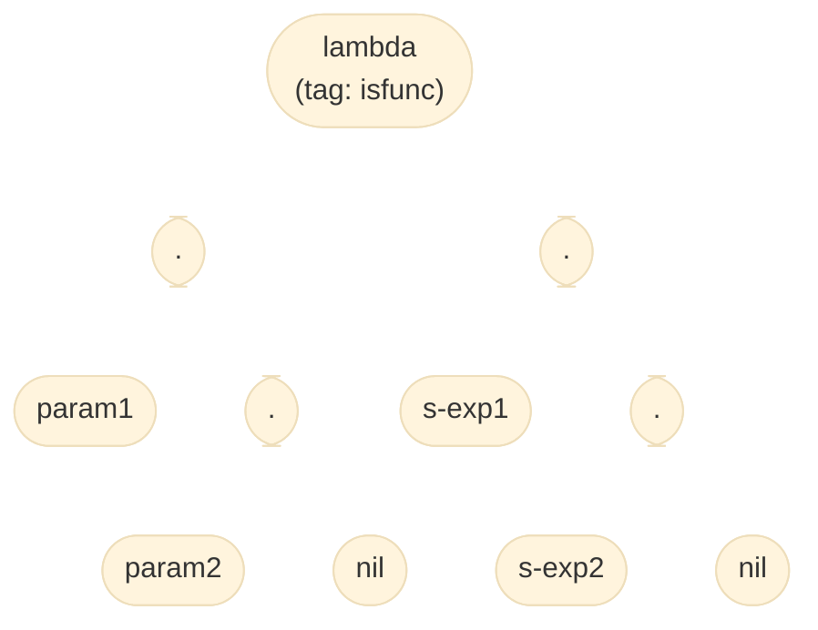
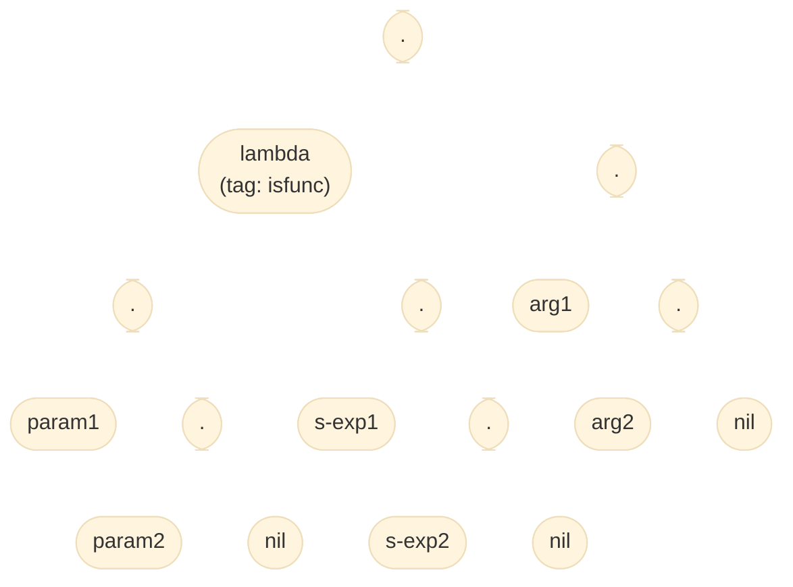

### [點我參考程式碼(將於專案截止日後轉為公開 repo)](https://github.com/ja-errorpro/CYCS_OurSchemeInterpreter/tree/bf0f8ca3aaadb9b758a11dcd1238e5aff20e81cb)

這邊統一一下對於 parameter 和 argument 的用詞定義：
> Parameter: 定義函數時的參數變數

> Argument: 呼叫函數時傳入的參數值

對於

`(define F (lambda (param1 param2) s-exp1 s-exp2))`

執行 `(F arg1 arg2)` 時將建出以下資料結構：

---

對於

`(define (F param1 param2) s-exp1 s-exp2)`

執行 `(F arg1 arg2)` 時將建出以下資料結構：

