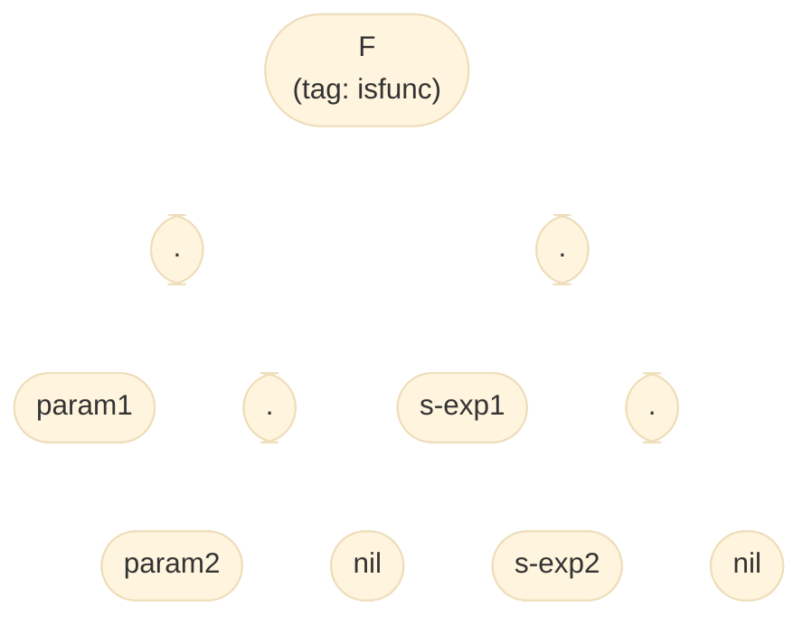
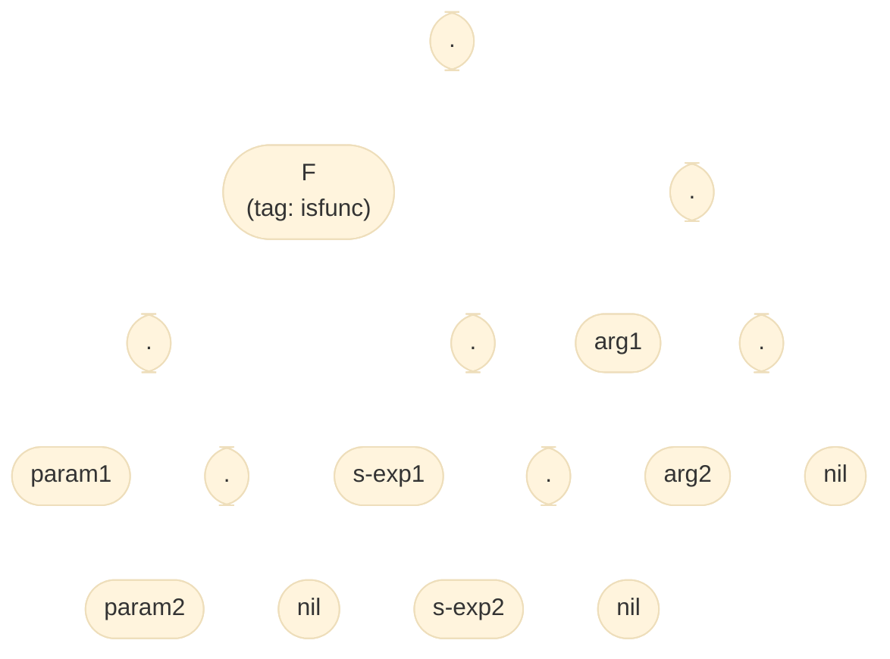

### [點我參考程式碼(將於專案截止日後轉為公開 repo)](https://github.com/ja-errorpro/CYCS_OurScheme_Interpreter)

這邊統一一下對於 parameter 和 argument 的用詞定義：

> Parameter: 定義函數時的參數變數

```go
func foo(param1, param2){
	...
}
```

> Argument: 呼叫函數時傳入的參數值

```go
foo(arg1, arg2)
```

對於

```scheme
(define F (lambda (param1 param2) s-exp1 s-exp2))
```


執行 `(F arg1 arg2)` 時將建出以下資料結構：


---

對於

```scheme
(define (F param1 param2) s-exp1 s-exp2)
```



執行 `(F arg1 arg2)` 時將建出以下資料結構：



## 變數作用域

以這個測資為例

```scheme
(define outer
    (lambda (x)
	  (lambda (y)
	    (+ x y))))

((outer 2) 3)
```

標準 scheme 的結果為：

```scheme
5
```

而 OurScheme 官方實測的結果為：

```scheme
unbound symbol x
```

可知 lambda 看不到他外面的區域變數，

但可以看到全域變數：

```scheme
(define x 2)
(define outer
    (lambda (x)
	  (lambda (y)
	    (+ x y))))
((outer 3) 4)
```

官方結果：`6` ($=2+4$)

因此在實作這個功能時，不用繼承區域變數。

### 而換成另一種定義函數的形式：

```scheme
(define (outer x)
	  (lambda (y)
	    (+ x y)))

((outer 2) 3)
```

標準 scheme 的結果為：

```scheme
5
```

而 OurScheme 官方實測的結果為：

```scheme
unbound symbol x
```

與上面例子一樣。
